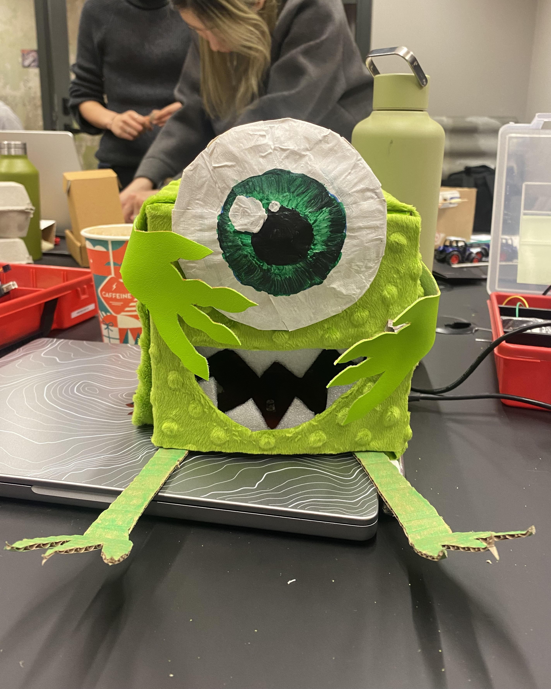

##  Friendly-Mike

by Carol Alice Tõniste & Helena Väinmaa

Project Image             |  In Action
:-------------------------:|:-------------------------:
  |   <video width="365" controls><source src="media/mikeVid.mp4" type="video/mp4"></video>


Mike needs to be first calibrated to the light in the room. When touched on the side he will start whining (photoresistor is activated) and when you put your hand in his mouth the other photoresistor reacts to it changing his pitch.

### Arduino Code

GitHub Repo: [https://github.com/CarolAlice/Friendly-Mike](https://github.com/CarolAlice/Friendly-Mike)

```c++
int sensorValue;
// set dummy values for numeric light indicator
int sensorLow = 1023;
int sensorHigh = 1020;
int photoresistor = A2;

int buzzer = 8;

const int onboardPin = 13;  // on-board indicator


void setup() {
  Serial.begin(9600);
  //assigning photoresistor the input
  pinMode(photoresistor, INPUT);

  // use little led on the board to show 5 seconds passing
  pinMode(onboardPin, OUTPUT);
  digitalWrite(onboardPin, HIGH);

  // do this for five seconds
  while (millis() < 5000) {
    // set the sensor value as what comes from the "A0" spot on the board
    sensorValue = analogRead(A0);

    // calibrate sensor - set light level numeric values as it is in reality
    if (sensorValue > sensorLow) {
      sensorHigh = sensorValue;
    }

    if (sensorValue < sensorLow) {
      sensorLow = sensorValue;
    }
  }

  // turn off indicator led
  digitalWrite(onboardPin, LOW);
}

void loop() {

  //giving photoresistor the assignmeng to drigger the sensor when lightvalue is certain number
  int lightValue = analogRead(photoresistor);
  if (lightValue > 700) {
    // read the sensor value from the A0 port
    sensorValue = analogRead(A0);
    Serial.println(sensorValue);

    // map the sensor value to the frequency:
    // sensorValue-  value to map;
    // sensorLow and sensorHigh - bounds;
    // 50 and 4000 - pitch bounds;
    int pitch = map(sensorValue, sensorLow, sensorHigh, 50, 4000);
    tone(buzzer, pitch, 20);
    delay(10);

  } else {
    noTone(buzzer);
  }

  delay(100);
}

```