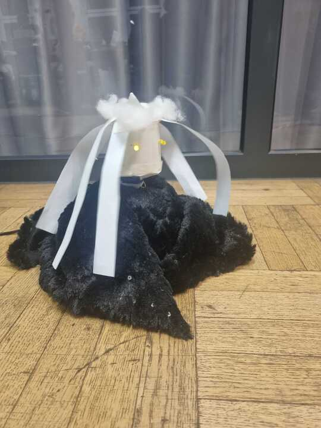

## Gertrud
by Marianna Zvereva & Rain Jaaksoo

Project Image             |  In Action
:-------------------------:|:-------------------------:
  |   <video width="330" controls><source src="media/gertrud.mp4" type="video/mp4"></video>
 
Gertrud is a dark princess singing Jingle Bells and keeping her glowing eyes on everybody. She wakes up only in darkness or when wearing her dark hat.


### Arduino Code


```c++
#include <Servo.h>
#include <pitches.h>

Servo myServo;

int photoResistor = A0;
int led1 = 7;
int led2 = 8;
/*int switchSlider = 10; */
int buzzer = 11;
int lightValue;
float buzzerSpeed;
int pos;

int melody[] = {
  NOTE_E5, NOTE_E5, NOTE_E5,
  NOTE_E5, NOTE_E5, NOTE_E5,
  NOTE_E5, NOTE_G5, NOTE_C5, NOTE_D5,
  NOTE_E5,
  NOTE_F5, NOTE_F5, NOTE_F5, NOTE_F5,
  NOTE_F5, NOTE_E5, NOTE_E5, NOTE_E5, NOTE_E5,
  NOTE_E5, NOTE_D5, NOTE_D5, NOTE_E5,
  NOTE_D5, NOTE_G5
};

int durations[] = {
  8, 8, 4,
  8, 8, 4,
  8, 8, 8, 8,
  2,
  8, 8, 8, 8,
  8, 8, 8, 16, 16,
  8, 8, 8, 8,
  4, 4
};

void setup() {
  pinMode(photoResistor, INPUT);
  /*pinMode(switchSlider, INPUT);  */
  pinMode(led1, OUTPUT);
  pinMode(led2, OUTPUT);
  pinMode(buzzer, OUTPUT);
  myServo.attach(6);
  Serial.begin(9600);
}

void loop() {
  /*
  int switchValue;
  switchValue = digitalRead(switchSlider);  
  if (switchValue == HIGH)   
  {  
*/

  lightValue = analogRead(photoResistor);

  if (lightValue >= 700) {  // BRIGHT
    digitalWrite(led1, LOW);
    digitalWrite(led2, LOW);
  }

  /* else if((lightValue >= 600) && (lightValue < 800)) { // MEDIUM LEVEL
  digitalWrite(led1,HIGH);
  digitalWrite(led2,HIGH);
  buzzerSpeed = 0.5;
  tune();
  } */

  else if (lightValue < 700) {  // DARK
    digitalWrite(led1, HIGH);
    digitalWrite(led2, HIGH);

    {
      int size = sizeof(durations) / sizeof(int);


      int position = 0;
      for (int note = 0; note < size; note++) {
        //to calculate the note duration, take one second divided by the note type.
        //e.g. quarter note = 1000 / 4, eighth note = 1000/8, etc.

        position += 15;
        Serial.println(position);
        myServo.write(position);

        int duration = 1000 / durations[note];
        tone(buzzer, melody[note], duration);

        //to distinguish the notes, set a minimum time between them.
        //the note's duration + 30% seems to work well:
        int pauseBetweenNotes = duration * 1.30;
        delay(pauseBetweenNotes);

        int goRight = random(0, 2);
        if (goRight == 1 ) {
          position = position + duration;
        } else {
          position = position - duration;
        }
        myServo.write(position);

        //stop the tone playing:
        noTone(buzzer);
      }

      for (pos = 0; pos <= 150; pos += 1) {
        myServo.write(pos);
        delay(8);
      }

      for (pos = 150; pos >= 100; pos -= 1) {
        myServo.write(pos);
        delay(8);
      }

      buzzerSpeed = 0.5;

      tone(buzzer, 330);
      delay(400 * buzzerSpeed);
      noTone(buzzer);
      delay(100 * buzzerSpeed);

      tone(buzzer, 392);
      delay(400 * buzzerSpeed);
      noTone(buzzer);
      delay(100 * buzzerSpeed);

      tone(buzzer, 262);
      delay(400 * buzzerSpeed);
      noTone(buzzer);
      delay(100 * buzzerSpeed);

      tone(buzzer, 292);
      delay(400 * buzzerSpeed);
      noTone(buzzer);
      delay(100 * buzzerSpeed);

      tone(buzzer, 330);
      delay(800 * buzzerSpeed);
      noTone(buzzer);
      delay(1600 * buzzerSpeed);

      for (pos = 100; pos >= 0; pos -= 1) {
        myServo.write(pos);
        delay(8);
      }

      for (pos = 0; pos <= 100; pos += 1) {
        myServo.write(pos);
        delay(8);
      }

      for (pos = 100; pos >= 60; pos -= 1) {
        myServo.write(pos);
        delay(8);
      }
    }

    Serial.println("Light value is " + String(lightValue));
  }
}


void tune1() {

  tone(buzzer, lightValue);
  delay(200 * buzzerSpeed);
  noTone(buzzer);
  delay(100 * buzzerSpeed);

  tone(buzzer, lightValue + 200);
  delay(200 * buzzerSpeed);
  noTone(buzzer);
  delay(100 * buzzerSpeed);

  tone(buzzer, lightValue + 400);
  delay(500 * buzzerSpeed);
  noTone(buzzer);
  delay(100 * buzzerSpeed);
}
/*
void tune2() {

  tone(buzzer, 330);
  delay(400 * buzzerSpeed);
  noTone(buzzer);
  delay(100 * buzzerSpeed);
  
  tone(buzzer, 330);
  delay(400 * buzzerSpeed);
  noTone(buzzer);
  delay(100 * buzzerSpeed);
    
  tone(buzzer, 330);
  delay(400 * buzzerSpeed);
  noTone(buzzer);
  delay(400 * buzzerSpeed);
  
  tone(buzzer, 330);
  delay(400 * buzzerSpeed);
  noTone(buzzer);
  delay(100 * buzzerSpeed);
  
  tone(buzzer, 330);
  delay(400 * buzzerSpeed);
  noTone(buzzer);
  delay(100 * buzzerSpeed);
  
  tone(buzzer, 330);
  delay(400 * buzzerSpeed);
  noTone(buzzer);
  delay(400 * buzzerSpeed);
  
  tone(buzzer, 330);
  delay(400 * buzzerSpeed);
  noTone(buzzer);
  delay(100 * buzzerSpeed);
  
  tone(buzzer, 392);
  delay(400 * buzzerSpeed);
  noTone(buzzer);
  delay(100 * buzzerSpeed);
    
  tone(buzzer, 262);
  delay(400 * buzzerSpeed);
  noTone(buzzer);
  delay(100 * buzzerSpeed);
  
  tone(buzzer, 292);
  delay(400 * buzzerSpeed);
  noTone(buzzer);
  delay(100 * buzzerSpeed);
  
  tone(buzzer, 330);
  delay(800 * buzzerSpeed);
  noTone(buzzer);
  delay(1600 * buzzerSpeed);

  }
  */

```