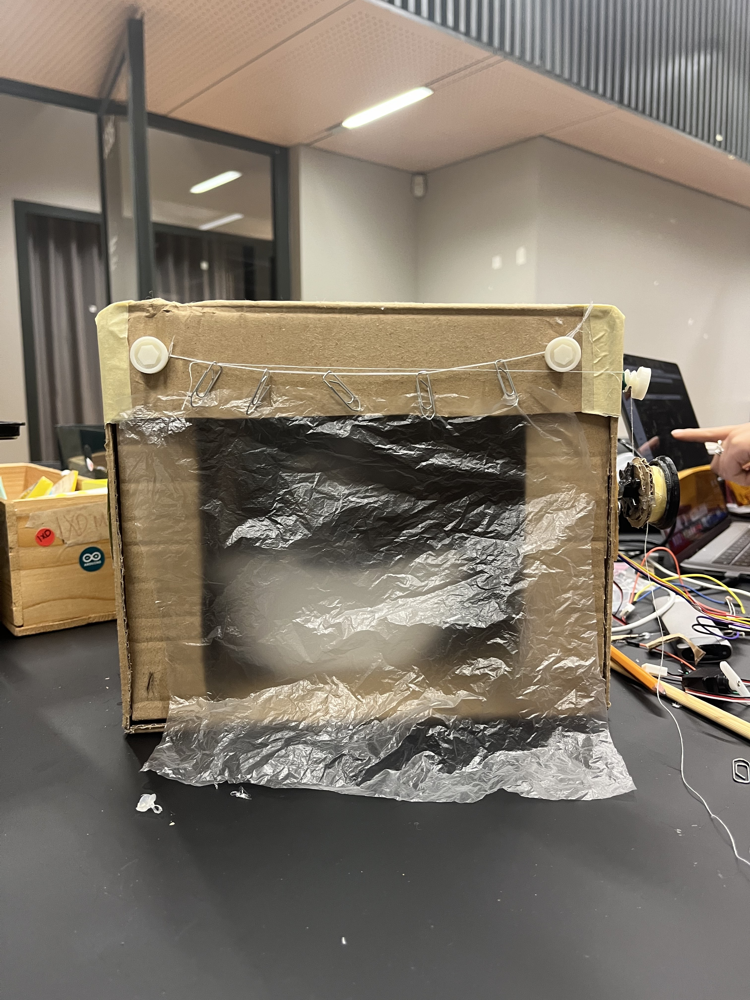

## Skeleton in the Shower
by Iie-Mall Püüa & Alisa Butenko

Project Image             |  In Action
:-------------------------:|:-------------------------:
  |   <video width="330" controls><source src="media/showerSkeleton.mp4" type="video/mp4"></video>
 
The light sensor turns on the stepper motor that pulls the curtain revealing a skeleton in the shower.

### Arduino Code

```c++

#include <Stepper.h>

const int stepsPerRevolution = 2048; // used https://gist.github.com/johnmckerrell/1590089

Stepper BigBoy(stepsPerRevolution, 5, 3, 2, 4); //defined pins of Stepper Motor

int Light = A0; //Photoresistor 
int Sound = 9;  //Buzzer - was used in 1st code, was not integrated into last one
int LEDW1 = 12; //Background white led 1
int LEDB = 11;  //Background blue led 
int LEDW2 =10;  //Background white led 2
int threshold = 300; //threshold for photoresistor  


void setup() 
{
  Serial.begin (9600);
  pinMode (Light, INPUT);
  pinMode (Sound, OUTPUT);
  pinMode (LEDW1, OUTPUT);
  pinMode (LEDB, OUTPUT);
  pinMode (LEDW2, OUTPUT);
  BigBoy.setSpeed(15); //RPM's
}

void loop() {

int LightValue = analogRead(Light);

  Serial.print("Light:" );
  Serial.print(LightValue); 
  Serial.println(" lum"); // used to uderstand current photoresistor value + to understand which value should be for threshold if environment change

    if (LightValue < threshold) //opens curtains
    {  

    for (int i = 0; i < 3; i++) {   // Rotate 360 degrees 3 times
      BigBoy.step(stepsPerRevolution);
   }

    digitalWrite(LEDW1, HIGH);
    digitalWrite(LEDB, HIGH);
    digitalWrite(LEDW2, HIGH);
}
   

  else    //closed . no light 
  {
    digitalWrite(LEDW1, LOW);
    digitalWrite(LEDB, LOW);
    digitalWrite(LEDW2, LOW);
  }

  delay(1000);

}

```