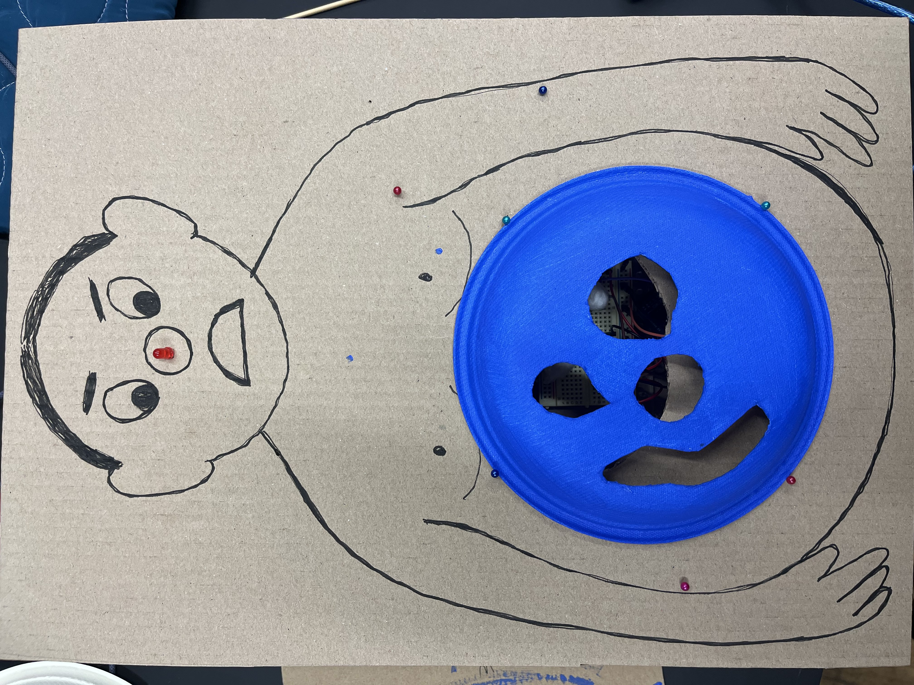

##  The man who eats cotton

by Luiza Stibe & Stella Tan

Project Image             |  In Action
:-------------------------:|:-------------------------:
  |   <video width="365" controls><source src="media/cottonVideo.MOV" type="video/mp4"></video>


Save the man by removing the excessive cotton in his stomach! Be very gentle though, he is afraid of pain and he’ll shout at you if you hurt him.

### Arduino Code


```c++
int buzzer = 7;
int photoresistor1 = A0;
int photoresistor2 = A1; 
int LED = 8;

void setup()
{
  Serial.begin(9600); 
  pinMode(LED,OUTPUT);
  pinMode(buzzer, OUTPUT);
}

void loop()

{
int lightValue1 = analogRead(photoresistor1);
int lightValue2 = analogRead(photoresistor2);

Serial.println(lightValue1);

if(lightValue1<400 || lightValue2<400) {
  digitalWrite(LED,HIGH);
  tone(buzzer, 330);
  }
  else{

  digitalWrite(LED,LOW); 
  noTone(buzzer); }

  }

```