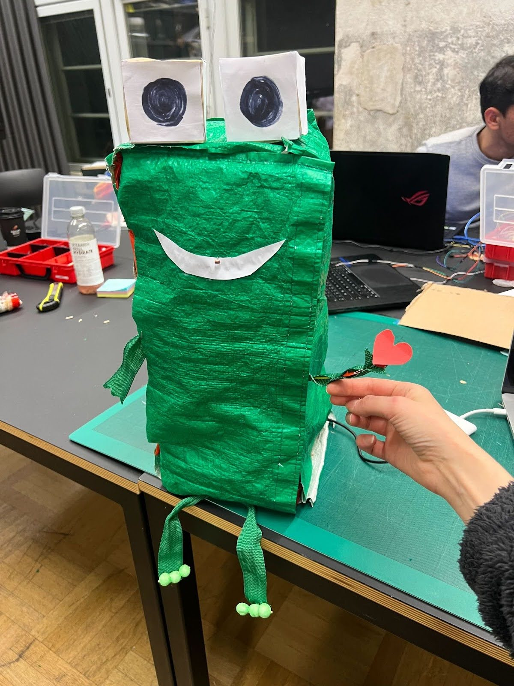

## Kiss the Frog 🐸

by Netta Konki & Beyza Yılmaz

Project Image             |  In Action
:-------------------------:|:-------------------------:
  |   <video width="365" controls><source src="media/kiss.MOV" type="video/mp4"></video>


The frog needs a little kiss! When you kiss him, our frog will get excited and you'll win its heart, and he’ll show its feelings to you by making its heart shine brighter.

To realize the project, we used light as the input and LED as the output.


### Arduino Code


```c++
int myPhotoresistor = A0;
int myLed = 4;


void setup()
{
  Serial.begin(9600);
 pinMode(myPhotoresistor, INPUT);
 pinMode(myLed, OUTPUT); //specify that myLed(Pin 4) should be used for OUTPUT
}


void loop()
{
 int lightvalue = analogRead(myPhotoresistor);
 Serial.println(lightvalue);
 if(lightvalue < 800){
 digitalWrite(myLed,LOW);
 }else{
 digitalWrite(myLed,HIGH);
  }
}


```