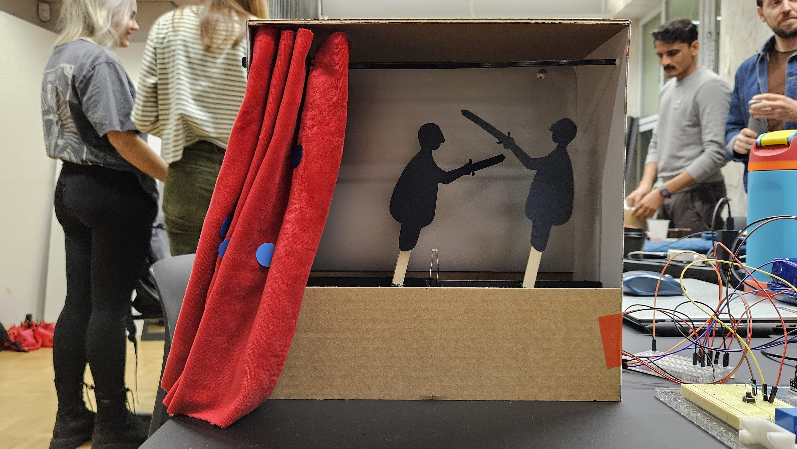

##  Light Fighters

by Sofija Katerīna Jākobsone & Kaitlin Safka

Project Image             |  In Action
:-------------------------:|:-------------------------:
  |   <video width="365" controls><source src="media/curtain.MP4" type="video/mp4"></video>


Two Little Fighters battle to the death when the curtain is drawn. The photoresistor triggers two servo motors to begin moving, and when a button is held, the motors stop. Whichever Little Fighter is closest to the ground at the end dies. End of play. 

### Arduino Code


```c++
#include <Servo.h>

Servo servo1; 
Servo servo2;

int myPhotoresistor = A0;
int pos = 0;
int myButton = 8;

void setup()
 
{
  pinMode(myPhotoresistor, INPUT);
  pinMode(myButton, INPUT);
  servo1.attach(2);
  servo2.attach(3);
  Serial.begin(9600);
  servo1.write(125);
  servo2.write(35);
}

void loop()
{
  int lightvalue = analogRead(myPhotoresistor);
  int buttonState = digitalRead(myButton);
  Serial.println(buttonState);
  //Serial.println(lightvalue);
  if (lightvalue >= 400){
  servo1.write(140);
  servo1.write(175);
    delay(300);
    servo1.write(140);
  delay(300);
  servo2.write(5);
  servo2.write(35);
    delay(300);
  servo2.write(5);
    delay(300);
  }
   
  else{
  servo1.write(155);
  servo2.write(35);
  }
  if (buttonState==1){
    servo1.write(165);
    delay(6000);
    servo2.write(5);
    delay(6000);
  }
}

```