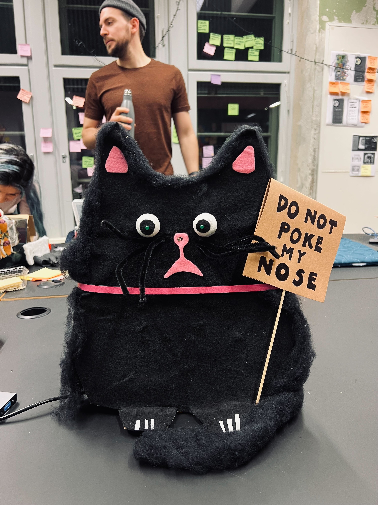

##  Stray Cat

by Eva & Marion

Project Image             |  In Action
:-------------------------:|:-------------------------:
  |   <video width="365" controls><source src="media/catVideo.MOV" type="video/mp4"></video>


Don’t boop the cat's nose!

When the cat's nose is touched and the photoresistor is triggered their LED eyes light up and they scream via a buzzer.

### Arduino Code


```c++
int lightSensor = A0;
int led1 = 4;
int led2 = 7;
int buzzer = 8;

void setup() {
  pinMode(led1, OUTPUT);
  pinMode(led2, OUTPUT);
  pinMode(buzzer, OUTPUT);
  Serial.begin(9600);
}


void loop() {
  int lightValue = analogRead(lightSensor);
  Serial.print("Light Sensor: ");
  Serial.print(lightValue);

  if (lightValue < 300) {
    digitalWrite(led1,HIGH);
    digitalWrite(led2,HIGH);
    tone(buzzer, 1000);
    delay(200);
    noTone(buzzer);
    digitalWrite(led1,LOW);
    digitalWrite(led2,LOW);
  }
  delay(100);
}

```