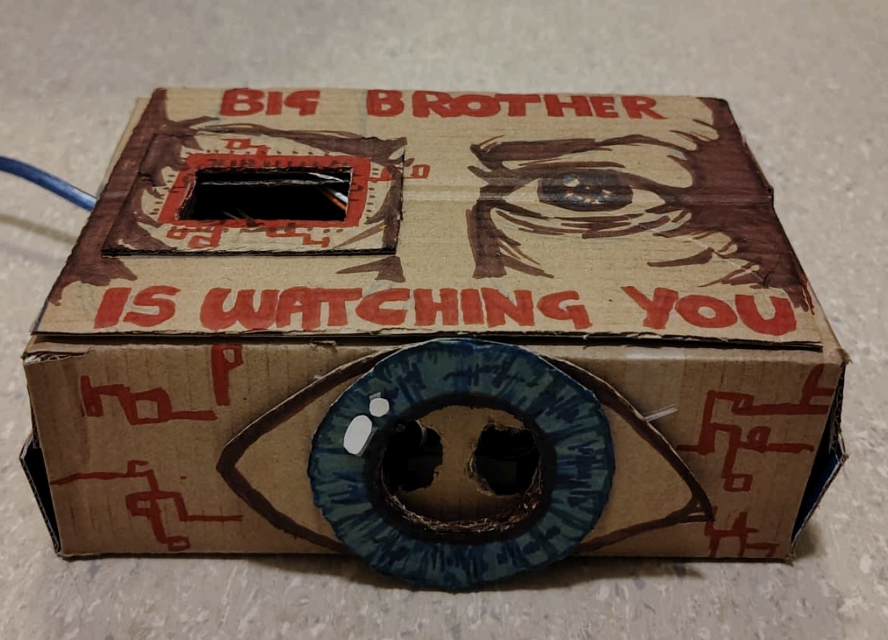

##  Big Brother Eye

By Sara De Simone & Arnab Saha

Project Image             |  In Action
:-------------------------:|:-------------------------:
  |   <video width="365" controls><source src="media/bigbro.mp4" type="video/mp4"></video>


This project is an Arduino-based interactive system inspired by security
technologies and the idea of Big Brother. It uses a distance sensor to
constantly watch the space around it and react to how close a person gets.
From far away, a green light signals, as someone moves closer, the light turns
yellow and a sound begins, when the distance becomes very close, the light
turns red and the sound grows louder, creating a feeling of alarm and
pressure.

Through the way it works, the project reflects the idea of Big Brother watching
every movement, exploring themes of constant surveillance, control, and how
being observed can slowly change our sense of freedom and comfort.

### Arduino Code


```c++
#define trigPin 7
#define echoPin 6
#define GreenLED 11
#define YellowLED 10
#define RedLED 9
#define buzzer 3
void setup() {
Serial.begin(9600);
pinMode(trigPin, OUTPUT);
pinMode(echoPin, INPUT);
pinMode(GreenLED, OUTPUT);
pinMode(YellowLED, OUTPUT);
pinMode(RedLED, OUTPUT);
pinMode(buzzer, OUTPUT);
}
void loop() {
long duration;
int distance;
digitalWrite(trigPin, LOW);
delayMicroseconds(2);
digitalWrite(trigPin, HIGH);
delayMicroseconds(10);
digitalWrite(trigPin, LOW);
duration = pulseIn(echoPin, HIGH);
distance = duration * 0.034 / 2;
// LED logic
digitalWrite(GreenLED, LOW);
digitalWrite(YellowLED, LOW);
digitalWrite(RedLED, LOW);
if (distance > 20 && distance <= 50) {
digitalWrite(GreenLED, HIGH);
noTone(buzzer);
}
else if (distance > 5 && distance <= 20) {
digitalWrite(YellowLED, HIGH);
tone(buzzer, 500);
}
else if (distance > 0 && distance <= 5) {
digitalWrite(RedLED, HIGH);
tone(buzzer, 1000);
}
else {
noTone(buzzer);
Serial.println("Out of range");
}
Serial.print("Distance: ");
Serial.print(distance);
Serial.println(" cm");
delay(300);
}

```