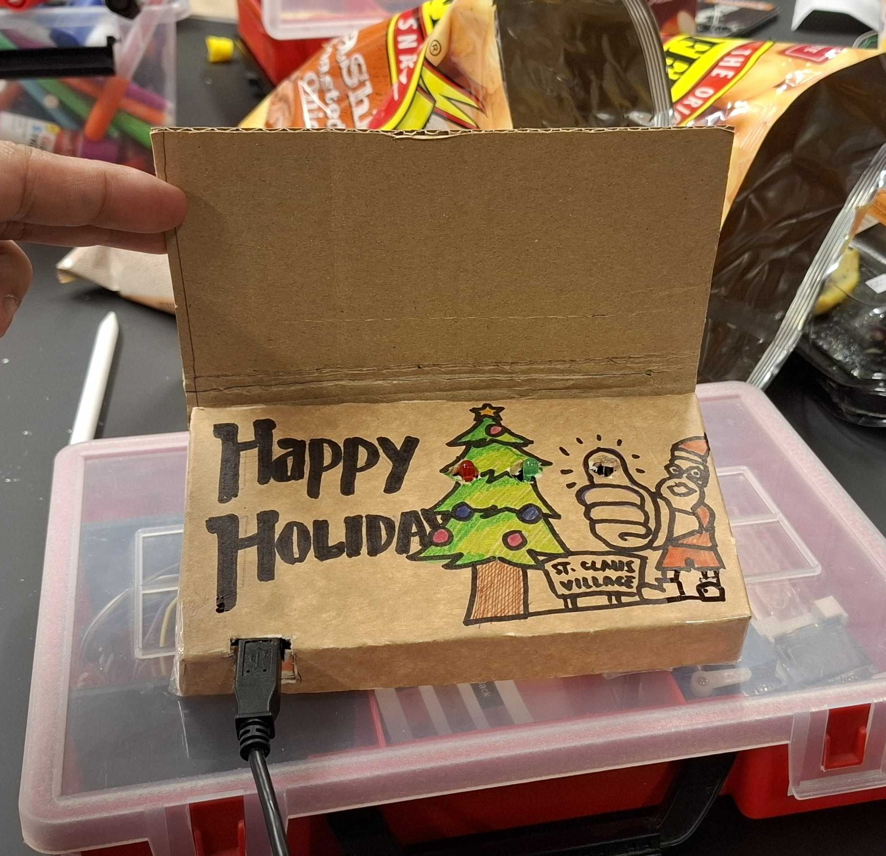

##  Christmas Card

By Evan and Daiga

Project Image             |  In Action
:-------------------------:|:-------------------------:
  |   <video width="365" controls><source src="media/christmas.mp4" type="video/mp4"></video>


You think you get a regular Christmas greeting, but magic happens as you open it. The photoresistor registers that the card is being read and starts blinking seasonal lights and puts on some festive music. Close the card for silence and peace. 

### Arduino Code


```c++
int myPhotoresistor = A0;
int GreenLed = 8;
int RedLed = 7;
int Music = 4;


void setup()
{
 Serial.begin(9600);
 pinMode(GreenLed,OUTPUT);
 pinMode(RedLed,OUTPUT);
 pinMode(Music,OUTPUT);
}


void loop()
{
 int lightValue = analogRead(myPhotoresistor);
  if(lightValue>300) {
 digitalWrite(GreenLed, HIGH);
 delay(500);
 digitalWrite(GreenLed, LOW);
 delay(500);
 digitalWrite(RedLed, HIGH);
 delay(500);
 digitalWrite(RedLed, LOW);
 delay(500);
  
 digitalWrite(GreenLed, HIGH);
 delay(500);
 digitalWrite(GreenLed, LOW);
 delay(500);
 digitalWrite(RedLed, HIGH);
 delay(500);
 digitalWrite(RedLed, LOW);
 delay(500);
  
 tone(Music, 330);
 delay(400);
 noTone(Music);
 delay(100);
  tone(Music, 330);
 delay(400);
 noTone(Music);
 delay(100);
   
 tone(Music, 330);
 delay(400);
 noTone(Music);
 delay(400);
  tone(Music, 330);
 delay(400);
 noTone(Music);
 delay(100);
  tone(Music, 330);
 delay(400);
 noTone(Music);
 delay(100);
   
 tone(Music, 330);
 delay(400);
 noTone(Music);
 delay(400);
  tone(Music, 330);
 delay(400);
 noTone(Music);
 delay(100);
  tone(Music, 392);
 delay(400);
 noTone(Music);
 delay(100);
   
 tone(Music, 262);
 delay(400);
 noTone(Music);
 delay(100);
  tone(Music, 292);
 delay(400);
 noTone(Music);
 delay(100);
  tone(Music, 330);
 delay(800);
 noTone(Music);
 delay(1600);


 }
   else{
 digitalWrite(GreenLed,LOW);
 digitalWrite(RedLed,LOW);
 digitalWrite(Music,LOW);
 }
  Serial.println(lightValue);
}


```