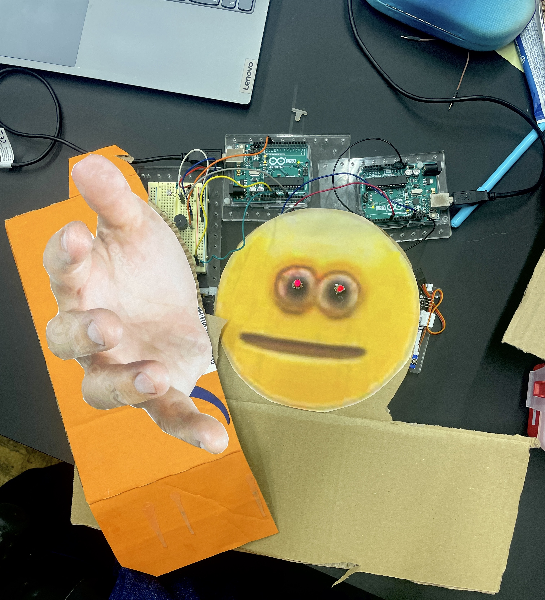

##  The Vibe Check Man

by Hendra & Duarte

Project Image             |  In Action
:-------------------------:|:-------------------------:
  |   <video width="365" controls><source src="media/vibe.mp4" type="video/mp4"></video>


Have you ever wondered what’s your vibe? We have a technical solution for you- A Vibe Check Man. It will react to you vibe (through a photo resistor) and play music according to it. We have two music: if your vibe is dark it will play Star Wars Theme Music and if your vibe is normal it will play Sans Boss Battle theme song. 

### Arduino Code

#### Code Light Sensor (THE VIBES)
```c++
int myPhotoresistor = A0;
int buzzer = 11; // pin 11
void setup() {
Serial.begin(9600);
pinMode(buzzer, OUTPUT);}
void loop() {
int lightValue = analogRead(myPhotoresistor); // assign sensor value to
variable
if (lightValue < 500)
{
tone(buzzer, 659); // E5
delay(150);
noTone(buzzer);
delay(30);
tone(buzzer, 659); // E5
delay(150);
noTone(buzzer);
delay(30);
tone(buzzer, 1319); // E6
delay(200);
noTone(buzzer);
delay(30);
tone(buzzer, 988); // B5
delay(200);
noTone(buzzer);
delay(30);
tone(buzzer, 932); // A#5
delay(200);
noTone(buzzer);
delay(30);
tone(buzzer, 880); // A5
delay(200);
noTone(buzzer);
delay(30);
tone(buzzer, 784); // G5
delay(200);
noTone(buzzer);
delay(30);
tone(buzzer, 659); // E5

delay(400);
noTone(buzzer);
delay(200); // pause before looping
}
if (lightValue < 400)
{
tone(buzzer, 392); delay(400); noTone(buzzer); delay(100); // g
tone(buzzer, 392); delay(400); noTone(buzzer); delay(100); // g
tone(buzzer, 392); delay(400); noTone(buzzer); delay(100); // g
tone(buzzer, 311); delay(300); noTone(buzzer); delay(100); // d#
tone(buzzer, 466); delay(100); noTone(buzzer); delay(100); // a#
tone(buzzer, 392); delay(400); noTone(buzzer); delay(200); // g
tone(buzzer, 311); delay(300); noTone(buzzer); delay(100); // d#
tone(buzzer, 466); delay(100); noTone(buzzer); delay(100); // a#
tone(buzzer, 392); delay(600); noTone(buzzer); delay(300); // g
}
Serial.println(lightValue); //print sensor value to console
}
```

#### Code Lights
```c++

int myPhotoresistor = A0;
int myLed = 8;
int myLed2 = 7;
void setup()
{
Serial.begin(9600);
pinMode(myLed,OUTPUT); //Set Led as output
pinMode(myLed2,OUTPUT); //Set Led as output
}
void loop()
{
int lightValue = analogRead(myPhotoresistor); // assign sensor value
to variable
if(lightValue<1000) {

digitalWrite(myLed,HIGH); //Turn on LED if value us lower then 500
digitalWrite(myLed2,HIGH);
}
else{
digitalWrite(myLed,LOW); //Turn off LED if otherwise
digitalWrite(myLed2,LOW); //Turn off LED if otherwise
}
Serial.println(lightValue); //print sensor value to console
}

```