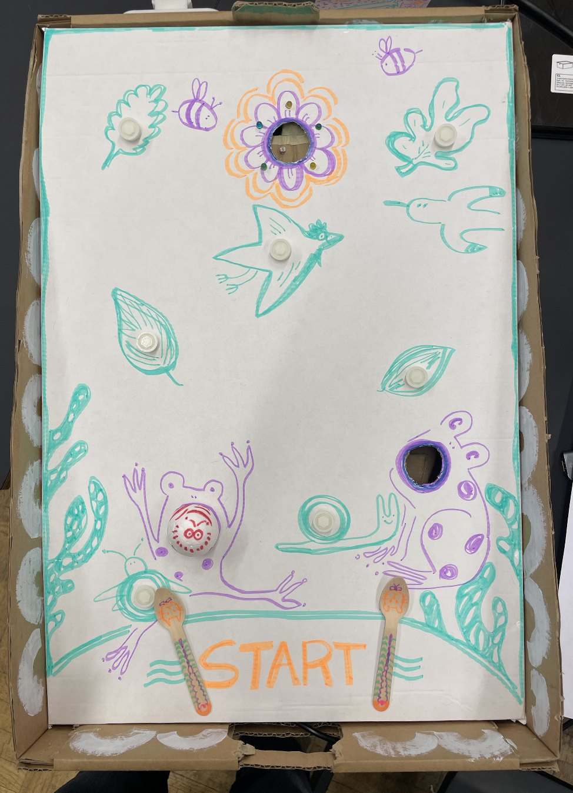

## Title
by Yachuan Chen & Yuko kinouchi

Project Image             |  In Action
:-------------------------:|:-------------------------:
  |   <video width="365" controls><source src="media/gardenBee.MOV" type="video/mp4"></video>
 
Try to push the bee to fly to the flower!
Don't forget, the frog may eat the bee, be careful

### Arduino Code

GitHub Repo: [https://github.com/yukokinouchi-artunee/my-pachinko-project](https://github.com/yukokinouchi-artunee/my-pachinko-project/blob/main/Pachinko_game/Pachinko_game.ino)

```c++
void setup() {
  // put your setup code here, to run once:

}

void loop() {
  // put your main code here, to run repeatedly:

}

```