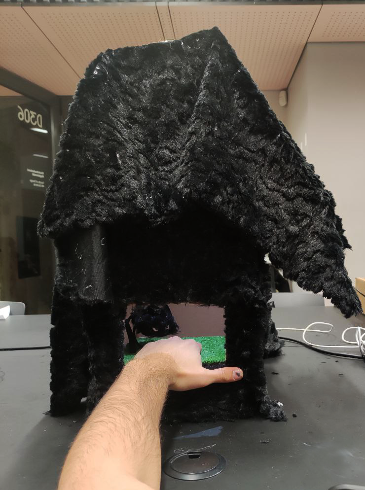

## Spider House
by Janeli Pelska & Tunahan Zilyas

Project Image             |  In Action
:-------------------------:|:-------------------------:
  |   <video width="330" controls><source src="media/SpiderHouse.mp4" type="video/mp4"></video>
 
Arduino Spider House project features a container and a surprise spider. As your hand enters the container through a hole, covering the light sensor underneath it, a servo is triggered, lowering the spider to the hand inside the container.

### Arduino Code

GitHub Repo: [https://github.com/janelipelska/EKA-Arduino-23](https://github.com/janelipelska/EKA-Arduino-23)

```c++

#include <Servo.h> // include Servo library

Servo myservo;  // create object to control a servo

int myPhotoresistor = A0;
bool stateOfServo = false;

int pos = 0;    // variable to store the servo position


void setup() {

  Serial.begin(9600);
  myservo.attach(9);

}

void loop() {

  int lightValue = analogRead(myPhotoresistor); // assign sensor value to variable

  if (lightValue<800) {
    if (stateOfServo == false) { 
      for (pos = 0; pos <= 180; pos += 1) { // goes from 0-180 degrees
        myservo.write(pos); 
        delay(15);  // waits (ms) 
        Serial.println(lightValue);
      }
    stateOfServo = true;
    }
  } else {
    if (stateOfServo == true) {
      for (pos = 180; pos >= 0; pos -= 1) { 
        myservo.write(pos);              
        delay(15); // waits (ms) 
        Serial.println(lightValue);
      }
    stateOfServo = false;
    }
  }  
}

```